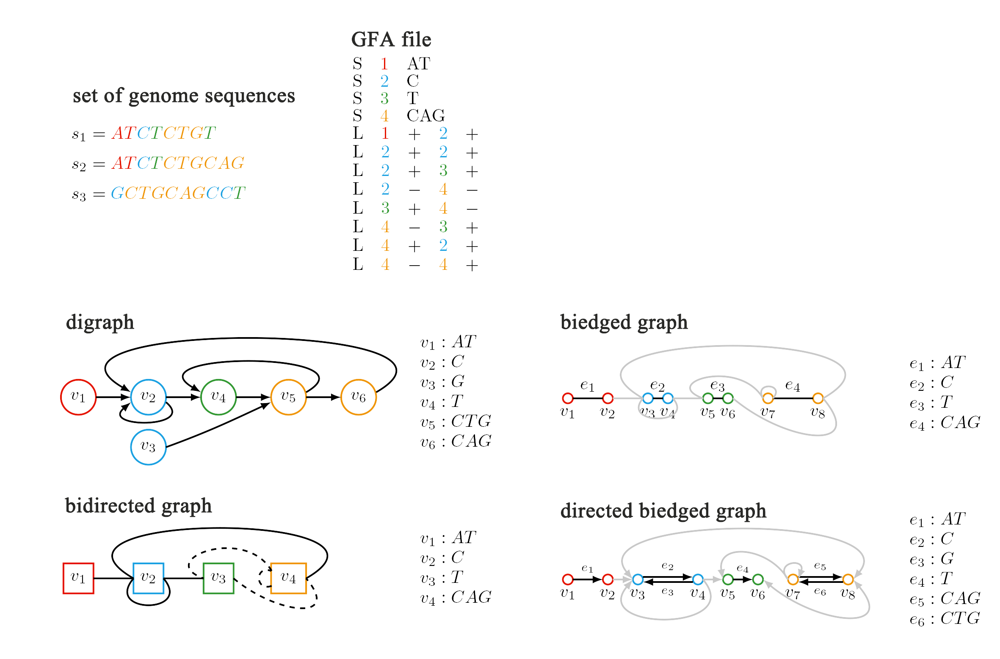

# gfaGlimpse

## Description
```gfaGlimpse``` is a tool designed to analyze graph statistics using GFA format input. We characterized the GFA file by modeling it with four different graph representations: **directed graph, bidirected graph, biedged graph, and directed biedged graph**. For each model, we computed statistics on vertices, edges, and subgraphs.



## Requirements on GFA file:
The tool supports GFA format versions **v1.0** and **v1.1**. Certain indicators may not function without path or walk information. 

Currently, the software performs well on graphs generated by ```pggb``` and ```minigraph-cactus```. If you encounter compatibility issues with graphs generated by other software, feel free to reach out to us.

## Installation
The command-line version is now fully implemented. You can clone the repository, compile the code, and run it locally.

**Git**
```
git clone https://github.com/YX-Xiang/gfaGlimpse.git
cd V0
# Replace the GFA file and output folder address in run.sh
bash run.sh
```